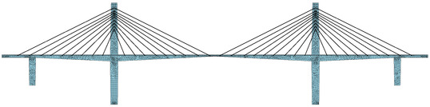

This is a Finite Element Program for the MIC-412 class at the Universidad Tecnica Federico Santa Maria.

Computational Solid Mechanics in 2D (CSM_2D)
============================================

**CSM_2D** is a software for solving continuum and structural mechanics problem in 2D. The format and code struture are presented in each assignment. The software covers:
    
* Linear operator for assembly and constraints
* Implementation of Truss, Frame and Quad elements
* Implementation of Static, Modal, and Dynamics analyses
* Numerical integration for iso-parametric elements
    
Theory and Documentation 
========================
*Computational Solid and Structural Mechanics*, Danilo S. Kusanovic, 2023.
